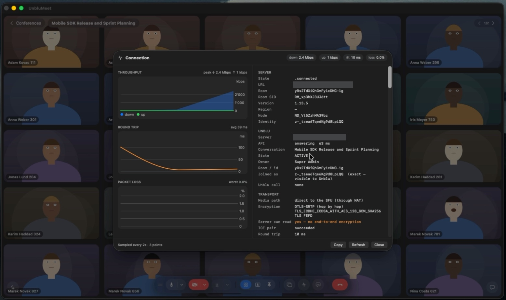

# UnbluMeet

UnbluMeet lets you check that a LiveKit deployment is reachable and healthy
from a real client — connection quality, media path, latency and packet loss,
shown live while the call runs.

It is a fully native macOS app: LiveKit for media, the Unblu Web API v4 for
conversations and chat, and no web view anywhere. Video and audio run through
LiveKit independently of the Unblu server.

Video is composited with Metal rather than one view per participant, which is
what makes 100 participants practical: unwatched tiles are unsubscribed and
their publishers stop uploading.

## What you can test

- **A LiveKit deployment** — connection time, ICE candidate type, whether media
  travels directly or through a relay, round-trip time, jitter, packet loss and
  throughput, all charted live while the call runs (⌘I).
- **Encryption and routing** — which node you landed on, what the transport
  negotiated, and whether the server can read the media.
- **Media end to end** — camera, microphone and screen sharing published
  through the app's own pipeline, so you see what actually survives the trip.
- **Behaviour under load** — the participant simulator fills a room with
  hundreds of participants, each publishing real video and real speech. Every
  one is a lightweight process replaying pre-encoded media rather than an
  encoder, so the count scales far beyond a browser-per-person setup.
- **An Unblu server's Web API** — conversations, people, messages and the
  message log, with API latency reported alongside.

## Demo

[](https://drive.google.com/file/d/1LKxbPWyvnjIYTZ_7YXGjVIyAZes2n7Rr/view?usp=share_link)

▶ Click the screenshot to watch the demo.

## What it does

- Grid, speaker and pinned layouts; drag tiles to rearrange them
- Screen and window sharing, including a region of a screen
- Annotation on a share: freehand marks and magnified callouts
- Live captions and a running call summary, both on device
- Background blur, and drawing the presenter over their own share
- Chat with file attachments, backed by the Unblu conversation

## Building

```
open UnbluMeet.xcodeproj
```

Requires macOS 26. The Xcode project is committed, so a clone builds as-is.
Sources live in file-system-synchronized folders, so adding a file needs no
regeneration — only a change to `project.yml` does, and that needs XcodeGen
(`brew install xcodegen`) and `xcodegen generate`.

## Configuration

No credentials ship in the source. On first launch, open Settings (⌘,) and
fill in:

- **LiveKit** — server URL, API key and secret. Tokens are signed locally, so
  no token service is needed.
- **Unblu** — Web API base URL, username and password. The address may stop at
  the host; `/app/rest/v4` is appended if missing.

Values are kept in UserDefaults, secrets in the keychain.

## Simulating participants

Fills a room with people who have faces and voices, so layouts, captions,
speaking indicators and the summary can be exercised alone — and so a server
can be put under load without a browser per participant:

```
LIVEKIT_URL=wss://… LIVEKIT_API_KEY=… LIVEKIT_API_SECRET=… \
  tools/simulate-participants.sh --room <conversation-id> --participants 8 --talkers 3
```

The room name is the Unblu conversation id. `--stop` ends a run.

## Tests

```
xcodebuild test -project UnbluMeet.xcodeproj -scheme UnbluMeet \
  -destination 'platform=macOS,arch=arm64'
```
